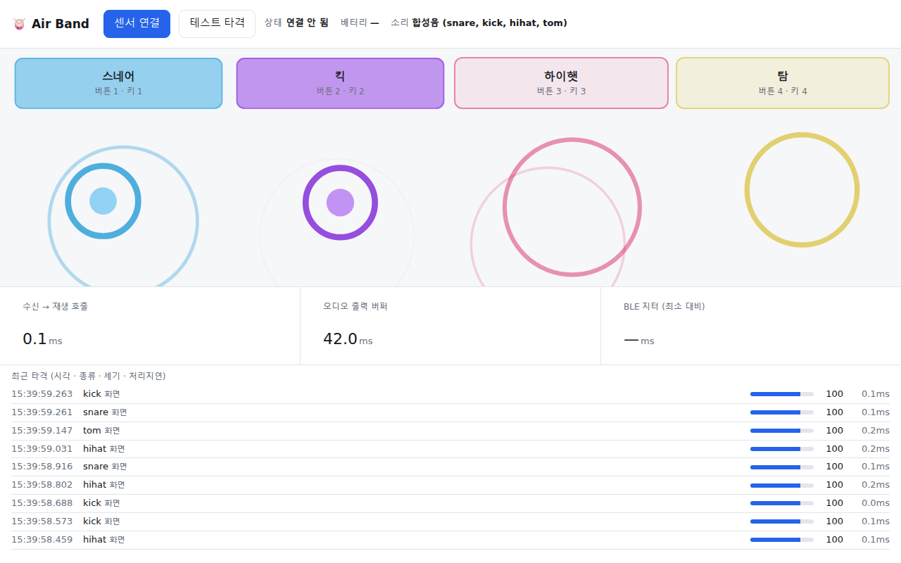
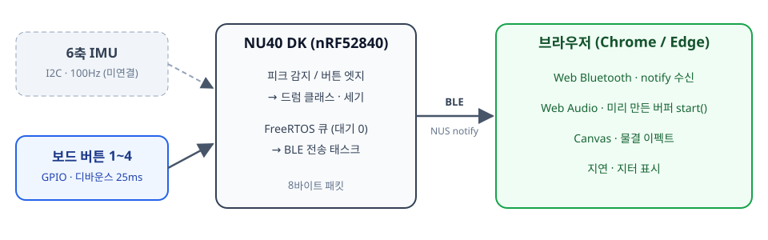
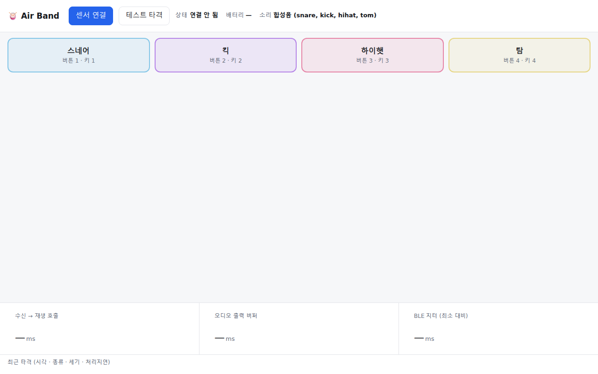
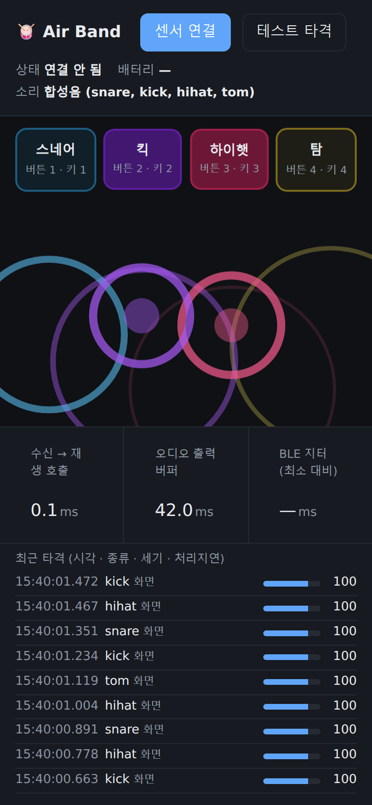

# 센서 없이 먼저 쳐 본 에어 드럼: nRF52840 + Web Bluetooth로 만든 Air Band PoC

> 스틱을 허공에 휘두르면 브라우저에서 드럼 소리가 나는 "에어 밴드"를 만들고 있습니다.
> 이 글은 그 1단계 기록입니다. 모션 센서(IMU)가 아직 없어서, **보드 버튼 4개로 드럼을 치는 PoC**부터 완성했습니다.



---

## 1. 무엇을 만드나

최종 목표는 간단합니다. 손목이나 스틱에 작은 보드를 달고 허공을 치면, 폰이나 PC 브라우저에서 드럼 소리가 납니다.

- **보드**: 누코드 NU40 DK (Nordic nRF52840, BLE 5)
- **센서**: 6축 IMU (가속도 + 자이로), I2C로 연결
- **앱**: 설치 없이 브라우저에서 바로 여는 웹앱 (Web Bluetooth + Web Audio)

앱을 따로 설치하지 않고 주소 하나로 여는 것이 핵심입니다. 그래서 네이티브 앱 대신 **Web Bluetooth**를 골랐습니다.

## 2. 전체 구조



```
[보드 버튼 / IMU] → [NU40 DK: 타격 판정 → 8바이트 패킷] --BLE--> [브라우저: 수신 → 재생 → 그리기]
```

보드는 "언제, 어떤 드럼을, 얼마나 세게" 쳤는지만 판단해서 8바이트로 보냅니다. 소리는 브라우저가 냅니다.

| 바이트 | 내용 | 값 |
|---|---|---|
| 0 | 손 | 0 = 오른손 |
| 1 | 모드 | 0 = 드럼 |
| 2 | 드럼 종류 | 0 스네어 · 1 킥 · 2 하이햇 · 3 탐 |
| 3 | 세기 | 1~127 (MIDI velocity와 같은 범위) |
| 4~7 | 보드 시각 | `millis()`, little-endian |

BLE 서비스는 표준에 가까운 **Nordic UART Service(NUS)** 를 그대로 썼습니다. 보드 쪽은 Bluefruit 라이브러리의 `BLEUart`, 브라우저 쪽은 notify 구독 한 줄이면 됩니다.

## 3. 펌웨어: 흔들림을 "타격"으로 바꾸기

IMU가 연결되면 이렇게 동작하도록 만들어 두었습니다.

1. **100Hz 샘플링**: `micros()` 경과 시간을 비교해 10ms 주기를 유지합니다.
2. **크기 계산**: 3축 가속도의 벡터 크기(g). 중력 1g가 포함된 값입니다.
3. **피크 감지**: 직전 샘플이 국소 최대값이고, 임계값(2.5g) 이상이고, 불응기(60ms)가 지났으면 타격입니다.
   피크 값을 정확히 쓰려고 한 샘플(10ms) 늦게 판정합니다.
4. **세기**: 피크 2.5g → 1, 12g 이상 → 127로 선형 변환합니다.
5. **분류 훅**: `classifyHit()`이 지금은 항상 스네어를 돌려줍니다. 2단계에서 TinyML 모델로 바꿀 자리입니다.

지연을 줄이려고 가장 신경 쓴 부분은 **BLE 전송을 샘플링 루프에서 분리**한 것입니다.
Bluefruit의 notify는 송신 버퍼가 차면 최대 100ms까지 기다릴 수 있습니다. 샘플링 루프에서 바로 보내면 그동안 샘플을 놓칩니다.
그래서 타격 이벤트는 FreeRTOS 큐에 **대기 없이(timeout 0)** 넣기만 하고, 별도 태스크가 꺼내서 보냅니다.

```cpp
static void emitHit(uint8_t cls, uint8_t vel, uint32_t ts) {
  HitPacket p;
  buildPacket(p, cls, vel, ts);
  xQueueSend(g_hitQueue, &p, 0);   // 대기 0: 큐가 가득 차도 막히지 않음
  ...
}
```

연결 간격도 7.5~15ms로 짧게 요청합니다 (중앙 장치가 다른 값을 줄 수는 있습니다).

## 4. 그런데 센서가 없었다

펌웨어를 올리고 웹앱에서 **센서 연결**을 눌렀는데, 목록에 `AirBand-R`이 나오지 않았습니다. 시리얼 로그를 열어 보니 원인이 바로 보였습니다.

```
[I2C] scan: 0x6A
[IMU] 감지 실패 — 배선/주소/모델 확인 후 재시도
[IMU] 0x6A reg0x0F=FF reg0x75=FF reg0x00=61
```

- I2C 버스에 장치가 `0x6A` 하나뿐입니다. 이것은 IMU가 아니라 **보드에 실장된 전원 관리 칩**입니다 (IMU의 WHO_AM_I 레지스터가 전부 `FF`).
- NU40 DK에는 IMU가 내장되어 있지 않습니다. 외부 모듈을 연결해야 하는데 아직 없었습니다.
- 펌웨어는 IMU를 찾을 때까지 기다리게 짜여 있어서, **BLE 광고조차 시작하지 않고** 멈춰 있었습니다.

덤으로 알게 된 사실도 있습니다. LSM6DS 계열 IMU의 기본 주소 중 하나가 `0x6A`라서, 이 보드에서는 **SA0 핀을 3V3에 연결해 0x6B로 써야** 충돌이 나지 않습니다.

## 5. 방향 전환: 보드 버튼 4개로 드럼 치기

센서가 올 때까지 손 놓고 있기보다는, **센서만 빼고 나머지 경로 전체를 먼저 검증**하기로 했습니다.
NU40 DK에는 버튼이 4개(P0.11, P0.12, P0.24, P0.25) 있습니다. 이 버튼들을 드럼 4개로 쓰면 됩니다.

| 보드 버튼 | 드럼 | 키보드 |
|---|---|---|
| 1 | 스네어 | `1` |
| 2 | 킥 | `2` |
| 3 | 하이햇 | `3` |
| 4 | 탐 | `4` |

펌웨어는 두 가지만 바꿨습니다.

- **IMU를 3번까지만 찾고**, 없으면 "버튼 전용 모드"로 넘어가 BLE 광고를 시작합니다.
- 매 루프마다 버튼을 읽어서 **눌리는 순간에만** 패킷을 보냅니다. 25ms 디바운스를 겁니다. 버튼은 세기를 모르니 세기는 100으로 고정합니다.

```cpp
static void pollButtons() {
  uint32_t nowMs = millis();
  for (uint8_t i = 0; i < BUTTON_COUNT; i++) {
    bool pressed = digitalRead(BUTTON_PINS[i]) == LOW;
    if (pressed == g_btnPressed[i]) continue;
    if (nowMs - g_btnChangedMs[i] < BUTTON_DEBOUNCE_MS) continue;
    g_btnPressed[i]   = pressed;
    g_btnChangedMs[i] = nowMs;
    if (pressed) emitHit(i, BUTTON_VELOCITY, nowMs);   // (실제 코드는 여기서 시리얼 로그도 찍음)
  }
}
```

패킷 형식이 같기 때문에, 나중에 IMU를 연결하면 **웹앱은 한 줄도 고치지 않고** 그대로 동작합니다. 버튼과 IMU가 같은 `emitHit()`을 거쳐 나갑니다.

바꾼 펌웨어를 올리자 부팅 로그가 이렇게 바뀌었습니다.

```
[IMU] 없음 — 버튼 전용 모드로 동작
[BTN] 버튼 1~4 → 드럼 0~3 (스네어/킥/하이햇/탐)
[BLE] 광고 시작: AirBand-R
```

- 플래시 사용량: 134,692 바이트 (전체의 16%)
- RAM 사용량: 16,168 바이트 (6%)

## 6. 웹앱: 받자마자 소리 내기

웹앱은 프레임워크 없이 TypeScript + Vite로 만들었습니다.



### 소리는 미리 만들어 둔다

타격이 올 때마다 파일을 읽거나 디코딩하면 늦습니다. 앱을 시작할 때 드럼 4개를 모두 `AudioBuffer`로 준비해 두고, 타격이 오면 `start()`만 호출합니다.

샘플 파일(`public/samples/*.wav`)이 없으면 **코드로 합성**합니다. 외부 에셋 없이도 바로 동작하게 하려는 것입니다.

| 드럼 | 합성 방법 |
|---|---|
| 스네어 | 220→160Hz 사인(몸통) + 고역 노이즈(스내어 와이어) |
| 킥 | 150→45Hz로 빠르게 떨어지는 사인 + 짧은 클릭 |
| 하이햇 | 약 5kHz 이상만 남긴 노이즈, 0.12초 |
| 탐 | 180→110Hz 사인 + 약한 노이즈 |

세기는 볼륨에 반영하는데, 선형으로 두면 약한 타격이 너무 크게 들려서 `(v/127)^1.6` 곡선을 씁니다.

### 화면

- **드럼 패드 4개**: 보드 버튼이 눌리면 해당 패드가 빛납니다. 마우스/터치나 키보드 `1`~`4`로도 칠 수 있어서, 보드 없이 시연할 때도 씁니다.
- **물결 이펙트**: 드럼마다 가로 위치와 색이 다릅니다. 세기가 셀수록 크게 퍼집니다.
- **타격 로그**: 시각, 드럼, 세기, 처리 지연, 그리고 입력이 보드인지 화면인지 표시합니다.


### 지연을 눈으로 확인하기

에어 드럼은 소리가 늦으면 바로 어색해집니다. 그래서 화면 하단에 지연을 세 가지로 나눠 표시합니다.


| 항목 | 의미 | 측정 예 |
|---|---|---|
| 수신 → 재생 호출 | BLE notify를 받은 순간부터 `start()` 호출까지 | 0.1~0.3ms |
| 오디오 출력 버퍼 | `baseLatency + outputLatency`. OS·오디오 장치가 정함 | 58ms (Windows, Chrome) |
| BLE 지터 | 가장 빨리 도착했던 패킷에 비해 이번 패킷이 얼마나 늦었나 | 보드 연결 시 표시 |

브라우저 안의 처리는 1ms도 안 걸립니다. 남은 지연은 대부분 **오디오 출력 버퍼**입니다. 블루투스 이어폰을 쓰면 여기가 100ms를 넘어가니, 시연할 때는 유선 스피커가 좋습니다.

보드 시계와 브라우저 시계는 맞춰져 있지 않아서 "센서→소리" 절대 지연은 잴 수 없습니다. 대신 (수신 시각 − 보드 시각)의 최솟값을 기준으로 얼마나 흔들리는지(지터)를 보여 줍니다.

### 모바일

Android Chrome에서도 동작합니다. 다크 모드도 지원합니다.



## 7. 개발하면서 겪은 문제들

**① WSL에서 `npm install`이 `EPERM: chmod`로 실패**
Windows 드라이브(`/mnt/c`)가 권한 정보 없이 마운트되어 있어서, esbuild 실행 파일에 실행 권한을 줄 수 없었습니다.
`/etc/wsl.conf`에 아래를 추가하고 `wsl --shutdown`으로 재시작해서 해결했습니다.

```ini
[automount]
options = "metadata,uid=1000,gid=1000,umask=022"
```

**② 코드를 고쳐도 브라우저에 반영이 안 됨**
WSL에서 `/mnt/c` 파일은 변경 알림이 오지 않아, Vite 개발 서버가 옛날 코드를 계속 돌려줬습니다. 폴링 감시로 바꿔서 해결했습니다.

```ts
server: { watch: { usePolling: true, interval: 300 } }
```

**③ 물결이 타원으로 찌그러짐**
캔버스 크기를 앱 시작 때 한 번만 쟀는데, 그 뒤에 패드가 추가되면서 캔버스 높이가 바뀌었습니다. `window.resize` 대신 `ResizeObserver`로 캔버스 자체를 관찰하도록 바꿨습니다.

**④ I2C 주소 0x6A 충돌**
4장에서 쓴 대로, 보드의 전원 칩이 0x6A를 쓰고 있습니다. LSM6DS 계열 IMU는 0x6B로 설정해야 합니다.

## 8. 다음 단계

1. **IMU 연결**: MPU-6050(0x68) 또는 LSM6DS3(0x6B) 모듈을 P0.26(SDA) / P0.27(SCL)에 연결하면, 펌웨어가 자동으로 감지해서 모션 모드로 동작합니다. 버튼도 계속 쓸 수 있습니다.
2. **임계값 튜닝**: 시리얼에 찍히는 `peak=` 값을 보고 타격 임계값과 최대 세기 값을 맞춥니다.
3. **TinyML 분류 (2단계)**: 디버그 플래그를 켜면 100Hz로 `ax,ay,az` CSV가 나옵니다. Edge Impulse로 동작별 데이터를 모아 학습시킨 뒤, `classifyHit()`을 모델 추론으로 바꾸면 **휘두르는 동작만으로 스네어/하이햇/탐을 구분**할 수 있습니다.
4. **왼손 추가**: 패킷에 이미 손(hand) 필드가 있습니다. 보드를 하나 더 만들면 양손 드럼이 됩니다.

---

### 사용한 것

- 보드: 누코드 NU40 DK (nRF52840), NUBoards nRF52 BSP 1.0.2, Arduino IDE
- 웹: TypeScript 5, Vite 5, Web Bluetooth, Web Audio, Canvas 2D
- 브라우저: PC Chrome/Edge, Android Chrome (iOS Safari는 Web Bluetooth 미지원)
